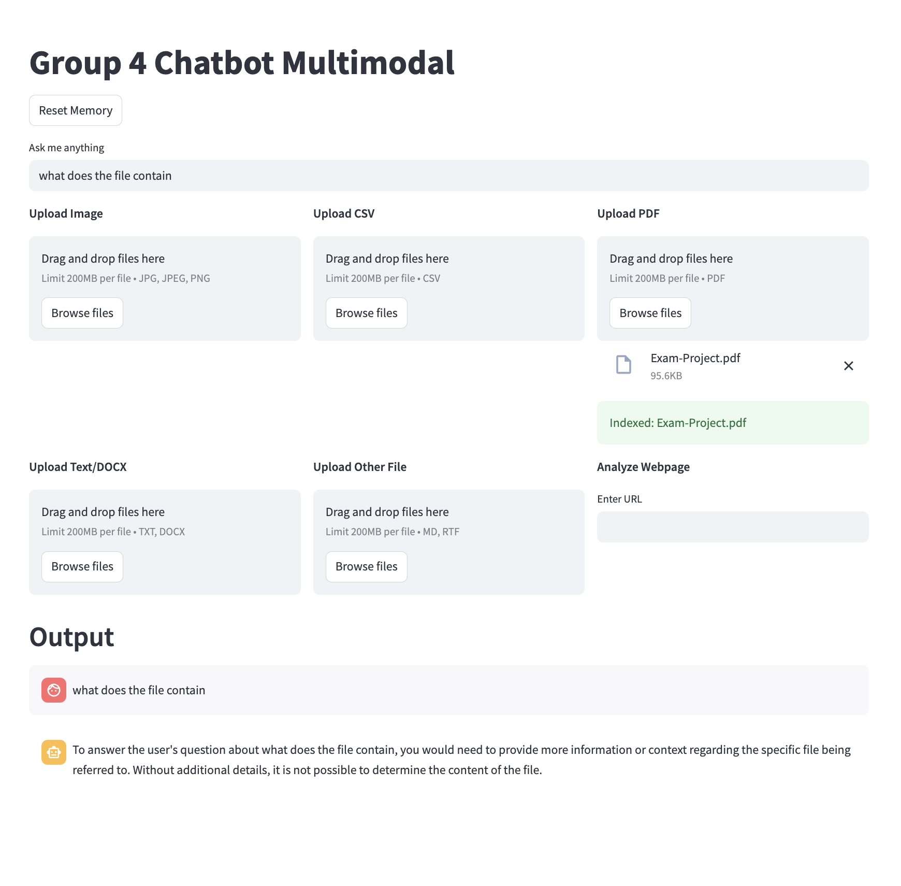

# MP4 – Multimodal Chatbot

**Created by Group 4 – Alberte & Felicia**  
We used pair programming to complete this project. Felicia led the implementation and code writing, while Alberte contributed through discussion, testing, and review.

**GitHub Repository:**  
https://github.com/FeliciaFavrholdt/DAT-BI-MP4




---

### Project Description

This project is a multimodal chatbot application built with Streamlit. It supports conversational interaction with various types of content:

- PDF documents  
- Text files (.txt, .docx)  
- CSV data  
- Image files (.jpg, .png)  
- Web page content via URL

The application uses Retrieval-Augmented Generation (RAG) and local large language models (LLMs) via Ollama. This approach enables private, offline document analysis and intelligent Q&A.

---

### Features

- Simple and modern dashboard interface  
- Upload and index multiple files at once  
- File tracking and downloadable chat history  
- Local LLMs:  
  - phi: optimized for text-based reasoning  
  - llava: capable of interpreting images  
- In-memory vector store for fast and private retrieval  
- Easy memory and session reset  
- Modular code structure using reusable utility and memory components  

---

### Setup Instructions

#### 1. Clone the Repository

```bash
git clone https://github.com/FeliciaFavrholdt/DAT-BI-MP4.git
cd DAT-BI-MP4
```

#### 2. Create and Activate a Virtual Environment

```bash
python -m venv venv
source venv/bin/activate        # macOS/Linux
venv\Scripts\activate         # Windows
```

#### 3. Install Dependencies

```bash
pip install -r requirements.txt
```

#### 4. Install Poppler (Required for PDF processing)

- macOS:  
  brew install poppler

- Ubuntu:  
  sudo apt-get install poppler-utils

- Windows:  
  Download Poppler for Windows from  
  https://github.com/oschwartz10612/poppler-windows  
  and add the bin folder to your system PATH.

#### 5. Pull the Required LLMs

Ensure that Ollama is installed and running, then pull the necessary models:

```bash
ollama pull phi
ollama pull llava
```

---

### Running the Application

```bash
streamlit run Dashboard.py
```

Navigate through the sidebar to access:
- The main chatbot interface  
- Project details  
- Memory viewer (chat and files)

---

### Folder Structure

```
multimodal_chatbot/
├── .gitignore
├── utils.py
├── memory.py
├── Dashboard.py
├── requirements.txt
├── README.md
├── data/
├── media/
├── vector_store/
└── pages/
    ├── 1_About.py
    ├── 2_Chatbot.py
    ├── 3_Memory.py
```

---

Made for MP4 project